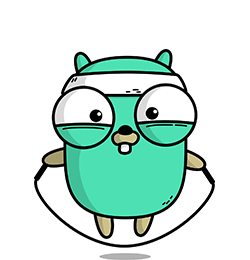

### Hi there 👋

I am Vinamra Jain, a passionate developer with 6+ months of professional remote working experience. 🎯

I mostly work with Golang and Cloud-Native technologies. 🚀

  
  
  
  
 

 ### Databases

 

  

### 📫 How to reach me? 

  ⦿ Connect with me on [LinkedIn](https://www.linkedin.com/in/vinamra-jain-2b5682128/) 👨🏻‍💻  
  ⦿ Follow me on [Twitter](https://twitter.com/jvinamra776) 🐦  
  ⦿ Shoot Me an [Email](mailto:jvinamra776@gmail.com) 💌  